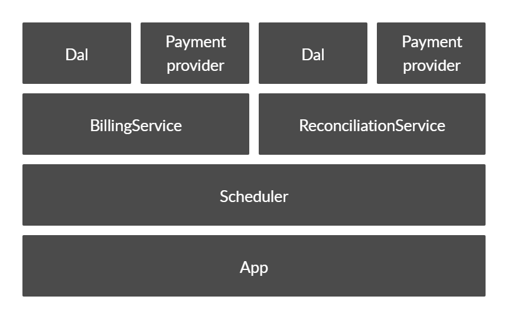
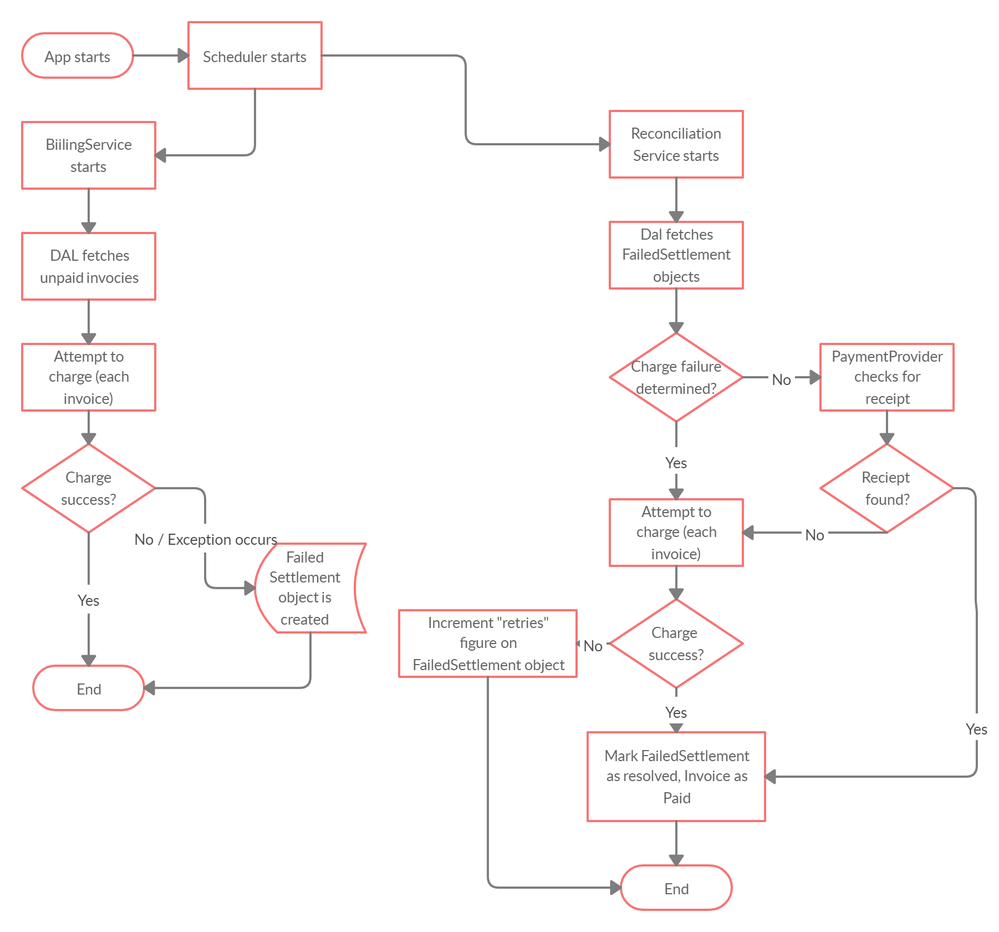

## Antaeus

Antaeus (/ænˈtiːəs/), in Greek mythology, a giant of Libya, the son of the sea god Poseidon and the Earth goddess Gaia. He compelled all strangers who were passing through the country to wrestle with him. Whenever Antaeus touched the Earth (his mother), his strength was renewed, so that even if thrown to the ground, he was invincible. Heracles, in combat with him, discovered the source of his strength and, lifting him up from Earth, crushed him to death.

Welcome to our challenge.

## The challenge

As most "Software as a Service" (SaaS) companies, Pleo needs to charge a subscription fee every month. Our database contains a few invoices for the different markets in which we operate. Your task is to build the logic that will pay those invoices on the first of the month. While this may seem simple, there is space for some decisions to be taken and you will be expected to justify them.

### Structure
The code given is structured as follows. Feel free however to modify the structure to fit your needs.
```
├── pleo-antaeus-app
|
|       Packages containing the main() application. 
|       This is where all the dependencies are instantiated.
|
├── pleo-antaeus-core
|
|       This is where you will introduce most of your new code.
|       Pay attention to the PaymentProvider and BillingService class.
|
├── pleo-antaeus-data
|
|       Module interfacing with the database. Contains the models, mappings and access layer.
|
├── pleo-antaeus-models
|
|       Definition of models used throughout the application.
|
├── pleo-antaeus-rest
|
|        Entry point for REST API. This is where the routes are defined.
└──
```

## Instructions
Fork this repo with your solution. We want to see your progression through commits (don’t commit the entire solution in 1 step) and don't forget to create a README.md to explain your thought process.

Please let us know how long the challenge takes you. We're not looking for how speedy or lengthy you are. It's just really to give us a clearer idea of what you've produced in the time you decided to take. Feel free to go as big or as small as you want.

Happy hacking 😁!

## How to run
```
./docker-start.sh
```

## Libraries currently in use
* [Exposed](https://github.com/JetBrains/Exposed) - DSL for type-safe SQL
* [Javalin](https://javalin.io/) - Simple web framework (for REST)
* [kotlin-logging](https://github.com/MicroUtils/kotlin-logging) - Simple logging framework for Kotlin
* [JUnit 5](https://junit.org/junit5/) - Testing framework
* [Mockk](https://mockk.io/) - Mocking library

## Thought Process

I dedicated the first 2 days to doing a crash course on Kotlin. To learn the syntax, how it differs from my strongest language, Python and to also get an appreciation of the best coding practices. Conveniently, the offical Kotlin docs have an extremely handy guide for people who are migrating from python such as myself [here](https://kotlinlang.org/docs/tutorials/kotlin-for-py/introduction.html). It was extremely beneficial. I learnt concepts which aren't present in python such as infix functions, overloading constructors, etc..

More about my what I learnt in another section.

The next logical step to me was to really deep dive into the code base. To really get an appreciation of the structure of the app and what was done by the devs before me. Also, to figure out how to run the project, its entry point, how the MVC paradigm was implemented, which classes are responsible for what function, as far as the MVC paradigm is concerned and to get a feel of how everything ties together. I needed to understand what has been done so far and what my task is. Understanding the task fully is half the battle.

Once I was satisfied that I know enough to navigate around the app, I needed to come up with a plan. A conceptual design. I identified the 2 classes I am mainly concerned about, the PaymentProvider class, and the BillingService class, which needs an instance of the PaymentProvider class as a dependency. The BillingService class delegates the actual process of charging a customer's credit card to the PaymentProvider class. Understanding that this delegation exists is key in modeling how the components of the app are positioned and how they transfer data to and from one another.



Immediately, a few concerns were raised. Handling successful payments is simple and straightforward enough but special attention needed to be paid to the unsucceful payments, Especially when a netowrk error occurs. 

There are 2 basic components to a network request, a request and a response. Should either of these 2 fail, a network exception will occur but the repercussions are indeed very different. If the request fails to be sent, it is safe to retry, but if it's the response that fails, say in the case of a timeout, then it is unsafe to retry. It is unknown here what would've really caused the network exception but it is safe to say that, the we have an unreliable link in our system.

This reminded me of the classic [2 generals problem](https://en.wikipedia.org/wiki/Two_Generals%27_Problem), which was proved to be unsolvable. In any case, it is unsafe to retry charging a customer in the case of a network exception because we do not know what raised the exception, lest we charge the customer several times. If only there was a way to use the PaymentProvider to query whatever payment gateway is in use for successful payments then we could potentially allow retries, but I'm sure that's not in the scope of the task. Or is it?

To minimize the level of human intervention needed, I decided it's worth modifying the payment provider to allow checks across our payment gateway for payment statuses. This meant our system could potentially allow for retries, but a finite number of times, after an arbitrary number of minutes. Of course the attempt to check for payment status could raise network exceptions itself, we ought to handle those too.

I then decided to create ReconcliationService which will be solely responsible for retrying failed attempts to charge customers. Instead of adding a field in the invoice model which counts retries, I decided to create a new FailedSettlements model which would stores information such as the date the attempt occurred, the invoice ID, resolved or failure state, a log the actual error that occurred and the number of checks performed. This also allows us to read the number of retries, and if it exceeds MAX_RETRIES, we ought to escalate the issue to the engineers. More of how the engineers are notified is in the notifications section.

So our system flow diagram would look something of this sort.



One apparent truth is that, the BillingService and the ReconcliationService has to be scheduled. The BillingService runs every first day of the month, timezones deliberately ignored here for simplicity sake. The ReconcliationService will run on 5 minute intervals, processing each after 5, 30, and 120 minutes intervals, to allow for time for the network to get back up. Obviously I needed some sort of cron service which will schedule my tasks and also a package with allows me to run these tasks on a thread separate from that which the main REST application runs on. Coming from a python background, I know of a package called [Celery](http://www.celeryproject.org/) which does exactly this and so, I looked for a Kotlin equivalent. For this I turned to an open source packaged named [Sundail](https://knowm.org/open-source/sundial/). It had pretty straight forward documentation and so it was a breeze to use.

With that done, it's time to develop the BillingService and the ReconciliationService, according to our spec.

## Notifications

The system occasionally logs errors to a .log file as well as success messages but at the same time will send emails to the engineers and customers. The process of sending emails is abstracted but it works as a proof of concept. Errors logged to a log file can be monitored by a tools such as logdna which can them use webhooks to unobtrusively notify the developers in a slack channel for example. Customer notification is done solely via email on successfully payment, on credit card declined and on currency mismatch. Engineers are notified via email or slack.

## Learnings

This was a challenge that I personally felt was very intrested. It challenged me to think and plan more than it required me to code, which I feel is very refreshing. I got to broadly learn Koltin's syntax, how it differes from python, concepts like infix operators, elvis operators, safe call operators, coroutines etc and [a lot more concepts](https://kotlinlang.org/docs/reference/basic-syntax.html).

## Improvements
The solution currently charges each invoice in sequence. One can imagine that in a situation where we have hundreds or thousands of customers, this is certainly not scaleable. Perhaps a solution which allows for multithreaded processing or batch processing would be invaluable.


## Final remarks
I really enjoyed it and overally I am satisfied with my solution.

It was a learning curve and I expect there would be concepts and ideas I overlooked or didn't think of at all. I'm actually quit curious to find out how Pleo implanted this solution in real life and also for the team to critic my solution and how it could potentially be improved.

